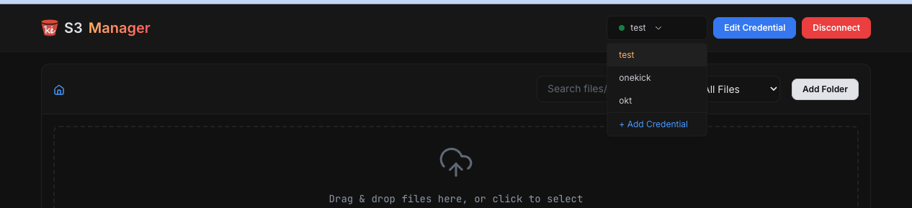
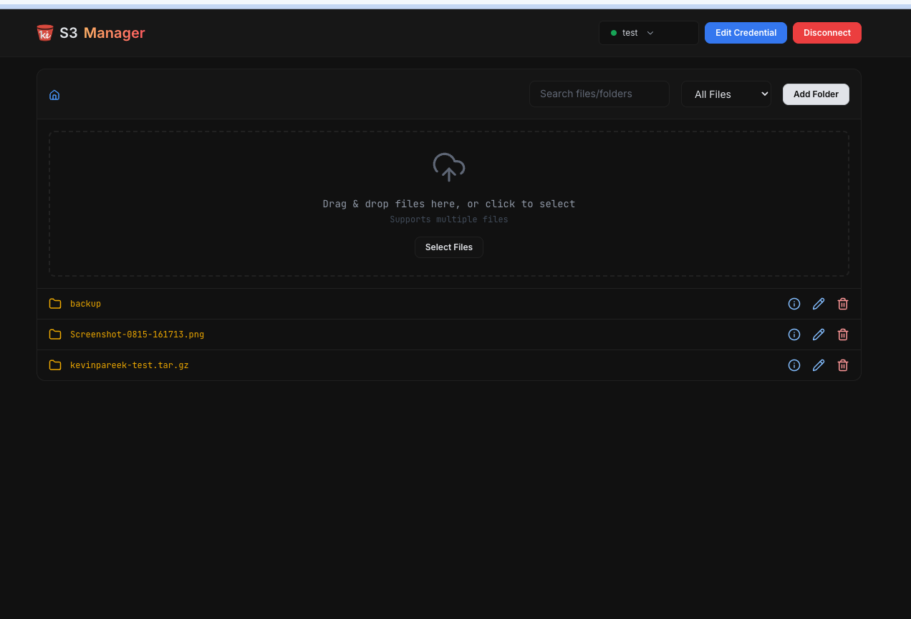
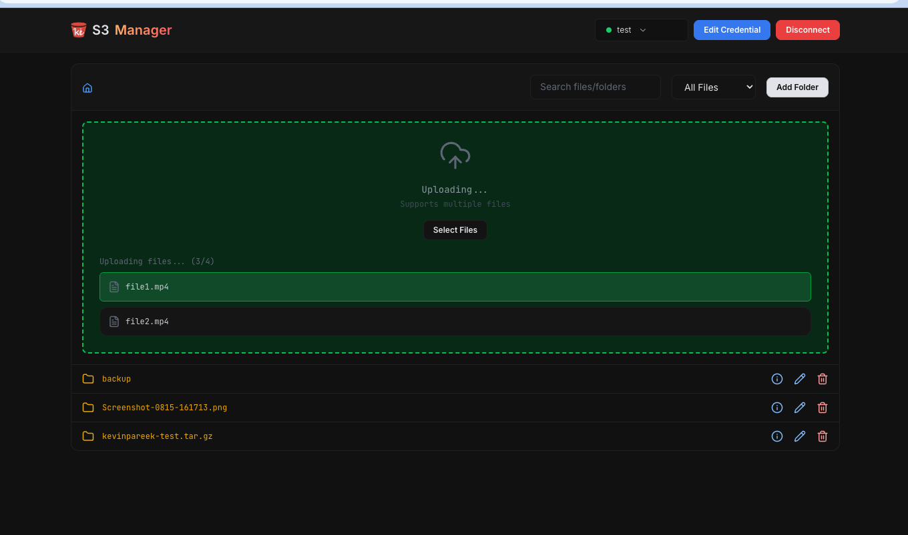
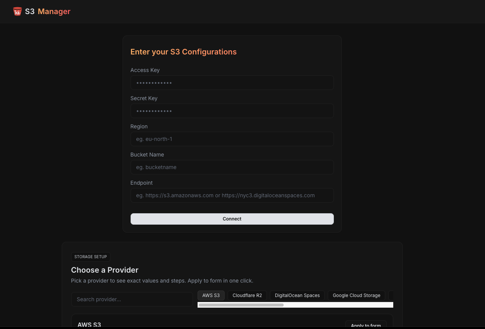

# S3 Storage Manager 🗂️

Modern, client‑side file manager for S3‑compatible storage. Built with React + Vite and AWS SDK v3. Manage buckets, browse folders, upload with multipart, rename, delete, search, preview, and generate signed URLs — across multiple providers and credentials.


## ✨ Features

### 🔐 Multi‑credential management
- Add, select, and manage multiple S3-compatible accounts
- Credentials stored locally in the browser (no server)
- Quick switch from the header dropdown; edit or disconnect anytime



### 📁 File & folder operations
- Drag & drop uploads with progress (multipart, 5 MB chunks)
- Create folders, rename files/folders (copy + delete under the hood)
- Delete files/folders (bulk via ListObjects + DeleteObjects)
- Breadcrumb navigation and inline path breadcrumbs per item
- Search recursively and filter by type (images, videos, docs, etc.)
- Info modal with signed preview/download URL and folder stats



### 🚀 Advanced
- Client‑only: signs requests locally via AWS SDK in the browser
- Responsive, dark UI with Tailwind CSS 4 and Lucide icons
- SPA routing with React Router; Vercel configuration included



## 🛠️ Tech stack
- React 19, Vite 7
- Tailwind CSS 4
- AWS SDK v3: `@aws-sdk/client-s3`, `@aws-sdk/s3-request-presigner`
- React Router DOM, React Toastify, Lucide React

## 📦 Installation

### Prerequisites
- Node.js ≥ 20 (enforced by `package.json`)
- npm or yarn

### Setup
1) Clone and install
```bash
git clone https://github.com/kevinpareek/s3-storage-manager.git
cd s3-storage-manager
npm install
# or
yarn install
```

2) Start dev server
```bash
npm run dev
# or
yarn dev
```
Visit `http://localhost:5173`.

## 🚀 First‑run & usage

### 1) Enter credentials
On first run you’ll be redirected to `/config` to add a credential set:

- Name: friendly label for the account/bucket
- Access Key / Secret Key
- Region (e.g. `us-east-1` or `auto` for some providers)
- Endpoint (required for non‑AWS providers)

The form includes provider presets and copy‑paste helpers for CORS and policies.



### 2) Manage files
- Drag & drop files into the drop area to upload
- Create folders, rename or delete items
- Use search and file‑type filter; navigate with breadcrumbs
- Click the info icon to view details, signed preview/download URLs, and folder stats

### 3) Multiple accounts
Use the header dropdown to switch accounts, add new ones, or disconnect.

## 🔧 Configuration notes

### Supported providers (tested presets)
- AWS S3
- Cloudflare R2 (endpoint: `https://<accountid>.r2.cloudflarestorage.com`, region: `auto`)
- DigitalOcean Spaces (e.g., `https://nyc3.digitaloceanspaces.com`, region: `nyc3`)
- Google Cloud Storage (Interoperability/HMAC)
- IBM Cloud Object Storage
- Oracle Cloud Object Storage
- Scaleway Object Storage
- Wasabi
- Any S3‑compatible provider

### Required CORS (example)
```json
[
  {
    "AllowedHeaders": ["*"],
    "AllowedMethods": ["GET", "PUT", "POST", "DELETE", "HEAD"],
    "AllowedOrigins": ["*"],
    "ExposeHeaders": ["ETag"],
    "MaxAgeSeconds": 3000
  }
]
```

For production, restrict `AllowedOrigins` to your domain.

### Minimal bucket policy (example)
Replace `<your-bucket-name>`:
```json
{
  "Version": "2012-10-17",
  "Statement": [
    { "Effect": "Allow", "Action": ["s3:ListBucket"], "Resource": ["arn:aws:s3:::<your-bucket-name>"] },
    { "Effect": "Allow", "Action": ["s3:GetObject", "s3:PutObject", "s3:DeleteObject"], "Resource": ["arn:aws:s3:::<your-bucket-name>/*"] }
  ]
}
```

### Security
- This is a client‑only app; credentials are stored in `localStorage` and used in‑browser to sign requests.
- Use dedicated, least‑privilege access keys limited to the target bucket.
- Consider rotating keys periodically.

## 📜 Scripts
- `npm run dev` — start dev server
- `npm run build` — production build
- `npm run preview` — preview build locally
- `npm run lint` — run ESLint

## 🏗️ Project structure
```
s3-storage-manager/
├── src/
│   ├── api/           # S3 operations (list, upload, rename, delete, search, stats, presign)
│   ├── components/    # UI components (dropper, finder, modals, header)
│   ├── context/       # Credentials provider (multi‑account)
│   ├── helpers/       # Utilities (filters)
│   ├── hooks/         # `useCredentials`
│   ├── pages/         # `/config`, `/` and edit views
│   └── main.jsx       # App entry
├── public/            # Static assets
└── package.json       # Scripts & deps
```

## 🔌 API (internal modules)
- `listFiles(s3, prefix, bucket)` — list folders/files using delimiter
- `addFolder(s3, folderPath, bucket)` — create placeholder folder object
- `deleteFileOrFolder(s3, key, bucket)` — bulk delete with `DeleteObjects`
- `renameFileOrFolder(s3, oldKey, newKey, bucket)` — copy + delete
- `renameFolder(s3, oldPrefix, newPrefix, bucket)` — copy + delete recursively
- `getFilePreview(s3, key, download, bucket)` — signed URL (1 hour)
- `getFolderStats(s3, prefix, bucket)` — sum size, earliest/latest modified
- `searchFilesAndFolders(s3, prefix, term, bucket)` — recursive search
- `MultiPartUpload(s3, file, dir, bucket)` — multipart upload (5 MB parts)

## 🎨 Customization
- Styling: Tailwind CSS 4; override tokens/classes in `src/index.css` and component classes
- Upload behavior: adjust chunk size in `src/api/MultiPartUpload.js` (defaults to 5 MB)

## 📦 Deployment

### Vercel (recommended)
Includes `vercel.json` with SPA rewrites. Deploy with default static output.

### Any static hosting
```bash
npm run build
# upload dist/ to your host; ensure SPA rewrites to index.html
```

## 🧩 Troubleshooting
- CORS blocked: set CORS on the bucket (see snippet above) and restrict origins appropriately
- AccessDenied/ListObjects: policy or key permissions missing (`s3:ListBucket` and object permissions)
- SignatureDoesNotMatch: wrong endpoint/region; ensure exact provider endpoint and region
- R2/GCS: use interoperability endpoints and HMAC keys; R2 region is `auto`
- Path style: app uses `forcePathStyle: true` (works well with MinIO/R2/Spaces)

## ⚠️ Known limitations
- Folder rename uses copy + delete; can be slow and incurs provider costs
- Recursive search/stats list objects; for very large buckets, operations may take time
- Signed URLs expire in 1 hour (tunable in `getFilePreview`)

## 📄 License
MIT — see `LICENSE`.

---

Built with ❤️ using React and AWS SDK v3.
